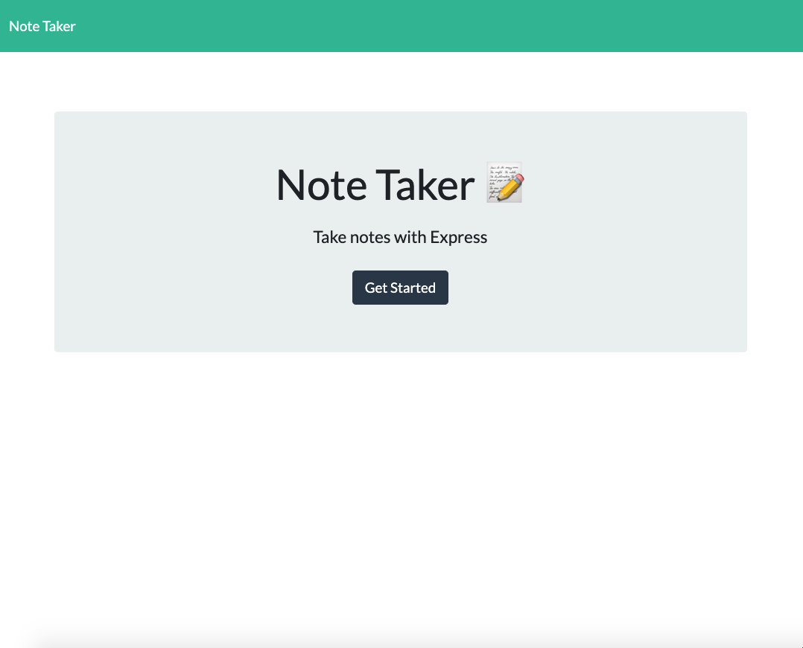
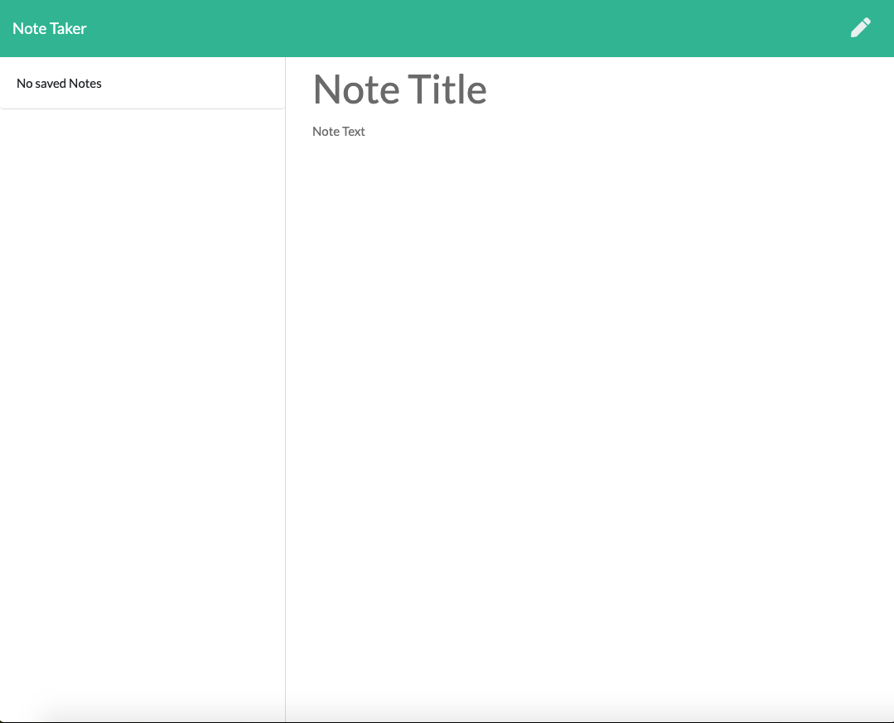

# Notepad App

## Description

An express.js app for logging and saving notes with titles.

## Table of Contents

- [Installation](#installation)
- [Usage](#usage)
- [Technologies](#technologies)
- [License](#license)

## Installation

Access this application by cloning this repository to your local machine and hosting on a local PORT.

## Usage

- Click the 'Get Started' button at the homepage.

- Use the pencil button in the top right to begin a new note

  - OR: Click the 'Note Title' text area to give your entry a title, then 'Note Text' to give it desired content

- Notes can be saved via the floppy disk icon located in the upper right corner of the notes page.

## Technologies

- Node.js
- Express.js
- Heroku
- Uniqid package

## Questions

If you have any questions, please contact jimbopulos at james.mgalantino@gmail.com

## License

This application is covered under the MIT license.

Copyright (c) 2021 James Galantino

Permission is hereby granted, free of charge, to any person obtaining a copy
of this software and associated documentation files (the "Software"), to deal
in the Software without restriction, including without limitation the rights
to use, copy, modify, merge, publish, distribute, sublicense, and/or sell
copies of the Software, and to permit persons to whom the Software is
furnished to do so, subject to the following conditions:

The above copyright notice and this permission notice shall be included in all
copies or substantial portions of the Software.

THE SOFTWARE IS PROVIDED "AS IS", WITHOUT WARRANTY OF ANY KIND, EXPRESS OR
IMPLIED, INCLUDING BUT NOT LIMITED TO THE WARRANTIES OF MERCHANTABILITY,
FITNESS FOR A PARTICULAR PURPOSE AND NONINFRINGEMENT. IN NO EVENT SHALL THE
AUTHORS OR COPYRIGHT HOLDERS BE LIABLE FOR ANY CLAIM, DAMAGES OR OTHER
LIABILITY, WHETHER IN AN ACTION OF CONTRACT, TORT OR OTHERWISE, ARISING FROM,
OUT OF OR IN CONNECTION WITH THE SOFTWARE OR THE USE OR OTHER DEALINGS IN THE
SOFTWARE.
